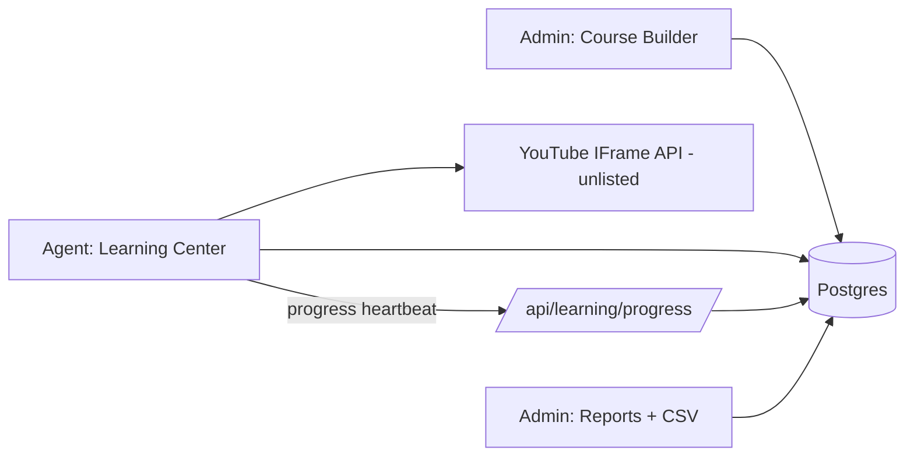

# Valor Learning Center (LMS) — PROJECT SPEC

## Gate 0: Vision
**Problem:** Valor agents need onboarding, product training, and compliance training in one place, with proof they actually watched the material.
**Users:** Agents (consume courses) and Admins — Phil Resch (creates ALL content, grants access, monitors completion).
**Success metrics:** Agents complete assigned courses end-to-end; Phil can prove completion (dashboard + CSV) for compliance; zero video-skipping.

## Gate 1: Architecture
**Stack:** Existing Valor stack — Next.js App Router (Vercel), Supabase Postgres via Prisma, Tailwind, existing AppLayout/auth.
**Video:** YouTube **unlisted** videos on Phil's channel, embedded via YouTube IFrame Player API with native controls hidden. Custom controls: play / pause / rewind ONLY. Client tracks `maxWatchedSeconds`; any forward seek snaps back. "Mark done" enabled only when maxWatched >= duration (minus 2s tolerance). Swappable to Vimeo later (we only store a video ID/URL).

**Data model (new tables — DDL via Supabase SQL Editor, NOT prisma db push):**
- `lms_courses` — id, tenantId, title, description, thumbnailUrl?, unlockMessage? (per-course override), isPublished, sortOrder, createdById, timestamps
- `lms_lessons` — id, courseId, title, description?, youtubeVideoId, durationSeconds, sortOrder, timestamps
- `lms_course_grants` — id, courseId, granteeType enum(ALL | ROLE | USER), role?, userId? (unique per combo)
- `lms_lesson_progress` — id, lessonId, userId, maxWatchedSeconds, completedAt?, updatedAt (unique lessonId+userId)
- `lms_settings` — tenantId, defaultUnlockMessage (global fallback message)
- Course completion = derived (all lessons in course completed).

**Auth/gating rules:**
- Admin (ADMINISTRATOR role) = full builder + reports.
- Agent sees ALL published courses; ungranted or sequence-locked = greyed out + lock icon + unlock message (course override → global default).
- Within a course: lesson N locked until lesson N-1 completed (sequential).
- Progress writes are server-validated: heartbeat can only increase maxWatchedSeconds by ~(elapsed + small buffer) — no client claiming "watched it all" in one POST.

## Gate 2: Features
**P0:**
1. DB schema + SQL script + Prisma models
2. Admin course builder: CRUD courses + lessons (paste YouTube URL, auto-extract video ID, fetch duration), reorder, publish toggle, unlock-message fields
3. Access grants: per ALL / role / user, managed per course
4. Agent Learning Center: catalog page (granted = active, locked = greyed + custom message), course page with sequential lesson list
5. No-skip video player: play/pause/rewind-10s only, progress heartbeat every 5s, resume where left off, "Mark Done" gate
6. Admin reports: per-course completion list (done / in-progress / not started), per-agent transcript, dashboard completion rates, CSV export
7. Sidebar: "Learning Center" link for all users; admin builder under admin area

**P1:** quizzes with pass score, completion certificates (PDF), due dates + overdue alerts, email nudges via Resend.
**P2:** groups/teams, Vimeo domain-locked upgrade, SCORM/CE credit tracking.

**Key user stories:**
- As an agent, I see every course but can only open the ones granted to me; locked ones show Phil's message.
- As an agent, I cannot fast-forward; I can pause/rewind; the course remembers where I stopped.
- As Phil, I build a course in minutes by pasting YouTube links, then pick who sees it (everyone / role / specific people).
- As Phil, I export a CSV showing who completed what and when.

## Gate 3: Implementation Plan (dependency order)
| # | Feature | Size | Key files |
|---|---|---|---|
| 1 | Schema + SQL + Prisma | M | `prisma/schema.prisma`, `scripts/create-lms-tables.sql` |
| 2 | API layer | M | `app/api/learning/courses/*`, `lessons/*`, `grants/*`, `progress/route.ts`, `reports/*` |
| 3 | Admin builder UI | L | `app/admin/learning/page.tsx`, `app/admin/learning/[courseId]/page.tsx` |
| 4 | Agent catalog + course pages | M | `app/learning/page.tsx`, `app/learning/[courseId]/page.tsx` |
| 5 | No-skip player | L | `components/learning/NoSkipPlayer.tsx`, `app/learning/[courseId]/[lessonId]/page.tsx` |
| 6 | Reports + CSV | M | `app/admin/learning/reports/page.tsx`, `app/api/learning/reports/export/route.ts` |
| 7 | Sidebar + polish | S | `components/layout/AppLayout.tsx` |

## Gate 4: Infrastructure
- No new services. No new env vars required (YouTube IFrame API needs no key; duration fetched client-side from player metadata on admin save).
- DDL applied manually in Supabase SQL Editor (valor_app_role lacks owner perms — same as FireLight tables). RLS disabled on lms_* tables to match firelight_* precedent, tenant scoping enforced in API layer.

## Gate 5: Launch Checklist
- [ ] Tenant scoping verified on every API route
- [ ] Locked-course click shows correct message (course override vs global)
- [ ] Forward-seek blocked (drag, keyboard, double-tap)
- [ ] Progress survives refresh / resume mid-video
- [ ] Server rejects implausible progress jumps
- [ ] Mobile player usable (agents will watch on phones)
- [ ] Empty states: no courses, no grants, no progress
- [ ] CSV opens clean in Excel
- [ ] WCAG AA on catalog + player controls
